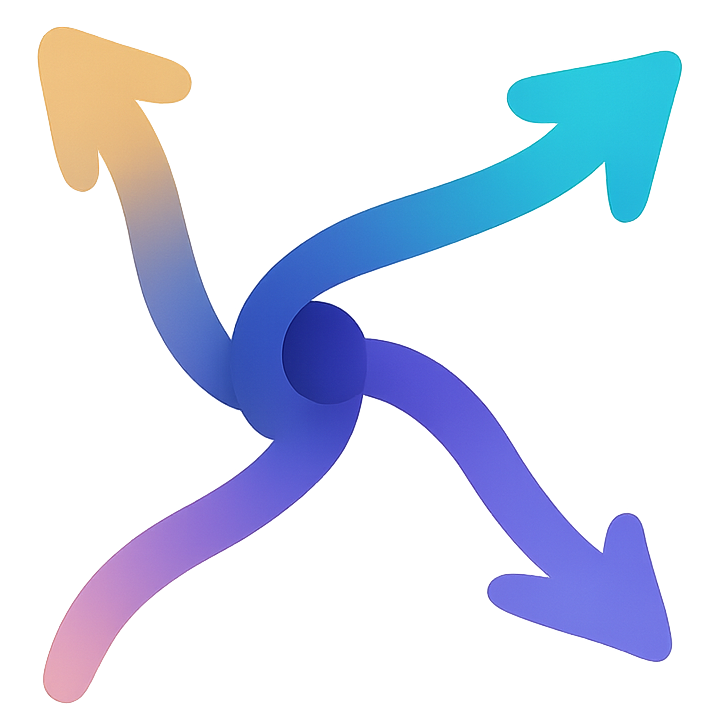

<div align="center">


# MultiPost

**Write once, publish everywhere.**
Publish posts, articles, videos and podcasts to 30+ social media platforms in one click, from a Windows desktop app or a browser extension.

[Download for Windows](https://github.com/HossamMarey/MultiPost-dt/releases/latest) · [Desktop app guide](desktop/README.md) · [Report an issue](https://github.com/HossamMarey/MultiPost-dt/issues)

</div>

---

## What is MultiPost?

MultiPost publishes content to many social platforms at once. You write your content once and choose where it goes. MultiPost then opens each platform's own publish page, fills in the title, text, tags and media, and can press the publish button for you.

It doesn't use platform APIs or API keys and doesn't need its own account. It works through your normal signed-in sessions, so anything you can post by hand, MultiPost can post for you.

This repository contains two apps that share the same platform integrations:

| | **MultiPost Desktop** | **MultiPost Browser Extension** |
| --- | --- | --- |
| Runs on | Windows 10/11 (64-bit) | Chrome, Edge and other Chromium browsers |
| Accounts | **Many accounts per platform**, each in its own isolated browser profile | The one account you're signed in to in your browser |
| Best for | Agencies, teams and creators who run several accounts | Individual creators who post from their own browser |
| Source | [`desktop/`](desktop/) | [`src/`](src/) |

## Features

- **One composer, four content types:** short posts (text plus images or videos), long-form articles (Markdown/HTML), videos and podcasts.
- **30+ platforms**, including X (Twitter), Instagram, Facebook, Threads, LinkedIn, Reddit, Pinterest, Bluesky, YouTube, TikTok, Substack, Bilibili, Douyin, Kuaishou, Weibo, Xiaohongshu (RedNote), Zhihu, WeChat Channels, Toutiao, Juejin, Douban and more.
- **Auto-submit or review:** let MultiPost press "Publish" on every platform, or leave each page filled in so you can review it and publish yourself.
- **Local only:** your content, accounts and sign-ins stay on your computer.

The desktop app also offers:

- **Unlimited accounts.** Each account has its own browser profile, so cookies and logins never mix. You can run ten X accounts next to ten Bilibili accounts.
- **Account groups.** Group accounts (for example "International" or "Launch day") and select a whole group with one click.
- **Different text per platform or per account,** plus placeholders (`{account}`, `{site}`, `{date}`, `{time}`) and automatic footers and hashtags for each group.
- **Live limit checks** while you type: character counts, title lengths, tag limits, image counts, video length and aspect ratio.
- **Confirmed results.** The app shows each target as Published (with a **View post** link), Rejected (with the platform's reason) or Not confirmed. Failed targets can be retried.
- **Pre-publish check.** Before you publish, the app checks that each account is signed in and that its publish page loads.
- **A proxy, timezone and language for each account,** with Chrome-like browser identity.
- **Optional AI rewrite** with Claude, which adapts your post to each platform's style and limits. It needs your own Anthropic API key.

---

## Installation

### Option A: Desktop app (Windows)

1. Go to the [**Releases**](https://github.com/HossamMarey/MultiPost-dt/releases/latest) page.
2. Download one of these files:

   | File | Use |
   | --- | --- |
   | `MultiPost-Desktop-Setup-<version>-x64.exe` | Installer (**recommended**) |
   | `MultiPost-Desktop-<version>-x64-portable.exe` | Portable, runs without installing |
   | `MultiPost-Desktop-<version>-win-x64.zip` | Unpacked app |

3. Run the installer. If Windows SmartScreen warns you about an unsigned app, click **More info → Run anyway**.

The app stores its data in `%APPDATA%\MultiPost Desktop`.

### Option B: Browser extension

**From the store (easiest):**

- [Chrome Web Store](https://chromewebstore.google.com/detail/multipost/dhohkaclnjgcikfoaacfgijgjgceofih)
- [Microsoft Edge Add-ons](https://microsoftedge.microsoft.com/addons/detail/multipost/ckoiphiceimehjkolnfffgbmihoppgjg)

**From source:**

Requirements: [Node.js](https://nodejs.org/) 20+ and [pnpm](https://pnpm.io/).

```bash
git clone https://github.com/HossamMarey/MultiPost-dt.git
cd MultiPost-dt
pnpm install
pnpm build            # production build in build/chrome-mv3-prod
```

Then load the build into your browser:

1. Open `chrome://extensions` (or `edge://extensions`).
2. Turn on **Developer mode**.
3. Click **Load unpacked** and select the `build/chrome-mv3-prod` folder.

---

## How to use

### Desktop app

1. **Add your accounts.** Open **Accounts → Add account**, pick a platform, give the account a name, and optionally add it to groups or set a proxy. A browser window opens. Sign in there, then close it. Repeat for every account.
2. **Check sign-in status.** Click **Check sign-in status** to confirm your logins, on platforms that support automatic checks.
3. **Compose.** Open **Compose**, choose a content type (Post, Article, Video or Podcast), write your content and attach media (drag and drop works). If you want, override the text for a specific platform or account and look at the preview.
4. **Pick targets and publish.** On the right, select accounts or whole groups. Turn **Auto-submit** on or off, then click **Publish**.
5. **Track results.** Open **Activity** to follow each target live. Use **Show** to bring a publish window to the front, and **Retry** for anything that failed.

In **Settings** you can change how many pages publish at once, page timeouts, window visibility, the language (English / 简体中文) and the theme, add an Anthropic API key for AI rewrite, and export or import a backup. A backup holds your accounts and groups but not your sign-ins.

See the [desktop app guide](desktop/README.md) for more detail.

### Browser extension

1. **Sign in** to the platforms you want to post on, in the same browser.
2. Click the **MultiPost** icon in the toolbar to open the publisher.
3. **Write your content.** Choose the content type, then enter a title, text, images or video.
4. **Select platforms** from the list. Run **Refresh accounts** to see which platforms you're signed in to.
5. Click **Publish**. MultiPost opens a tab for each platform and fills it in. With auto-publish on, it also submits each post. With auto-publish off, review each tab and publish it yourself.

Web apps and scripts can also send content to the extension through its messaging API. See [docs.multipost.app](https://docs.multipost.app) for details.

---

## Development

```bash
# Browser extension (repository root)
pnpm install
pnpm dev              # dev build with hot reload, in build/chrome-mv3-dev
pnpm lint             # Biome lint

# Desktop app
cd desktop
npm ci
npm run dev           # build and launch the Electron app
npm run typecheck
npm run test:unit
npm run dist:win      # Windows installer, portable exe and zip, in desktop/release/
```

### Project structure

```
src/
  sync/          Platform integrations (shared by the extension and the desktop app)
    dynamic/     Short posts      article/  Long-form articles
    video/       Videos           podcast/  Audio
    account/     Sign-in detection for each platform
  background/    Extension service worker (message routing, tabs)
  popup/ sidepanel/ tabs/ options/   Extension UI
desktop/
  src/main/      Electron main process (sessions, publisher, verifier)
  src/renderer/  Desktop UI (React and Tailwind)
locales/         Translations
```

**Adding a platform:** create an inject function under `src/sync/<type>/` and register it in the matching map (`DynamicInfoMap`, `ArticleInfoMap`, `VideoInfoMap` or `PodcastInfoMap`). Both the extension and the desktop app pick it up automatically. See [`CLAUDE.md`](CLAUDE.md) for the full checklist.

### Releasing the desktop app

Push a tag such as `desktop-v1.2.0`, or run **Actions → Desktop (Windows x64) → Run workflow**. GitHub Actions then tests, builds and publishes a release. See [`desktop/README.md`](desktop/README.md#releases) for code-signing setup.

---

## Credits and license

MultiPost builds on the open-source [MultiPost Extension](https://github.com/leaperone/MultiPost-Extension) by leaperone.
It is licensed under the [Apache License 2.0](LICENSE).
